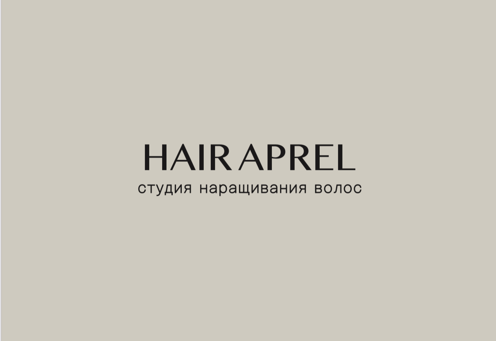
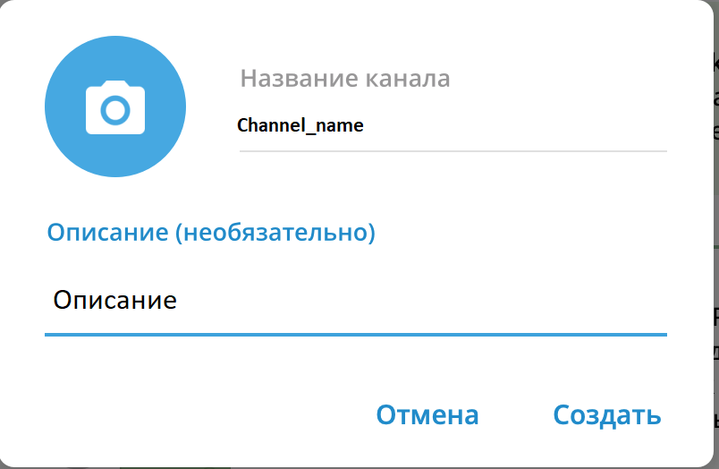

# DiplomaWork_v.1.0
<a id="readme-top"></a>


<!-- PROJECT LOGO -->
<br />
<div align="center">
    
  
<h1 align="center">Hair Aprel Studio</h1>

  <p align="center">
    <a href="http://127.0.0.1:8000/">Сайт салона красоты Hair Aprel</a>
    <br />
    <a href="https://github.com/shmelya008/DiplomaWork_v.1.0.git"><strong>Изучите документы</strong></a>
    <br />
  </p> 
</div>


<!-- TABLE OF CONTENTS -->
<details>
  <summary>Оглавление</summary>
  <ol>
    <li>
      <a href="#about-the-project">О проекте</a>
      <ul>
        <li><a href="#built-with">Создано с поддержкой</a></li>
      </ul>
    </li>
    <li>
      <a href="#getting-started">Начало работы</a>
      <ul>
        <li><a href="#installation">Установка</a></li>
      </ul>
    </li>
    <li><a href="#usage">Использование</a></li>
    <li><a href="#roadmap">Дорожная карта</a></li>
<!--     <li><a href="#contributing">Contributing</a></li>
    <li><a href="#license">License</a></li> -->
    <li><a href="#contact">Контакты</a></li>
<!--     <li><a href="#acknowledgments">Acknowledgments</a></li> -->
  </ol>
</details>


<!-- ABOUT THE PROJECT -->
## О проекте


Проект создан для моей подруги Кати Апрельской, блогера и владелицы студии красоты "Hair Aprel"
Этот мини сайт должен помочь ей расширить аудиторию клиентов студии, и помочь в администрировании бизнеса.

<p align="right">(<a href="#readme-top">back to top</a>)</p>


### Создано с поддержкой

* [![Bootstrap][Bootstrap.com]][Bootstrap-url]

<p align="right">(<a href="#readme-top">back to top</a>)</p>


<!-- GETTING STARTED -->
## Начало работы

Переходим в директорию HAProject

Создаем виртуальное окружение через командную строку python -m venv venv

Активируем виртуальное окружение:

Для Linux/Mac: source venv/bin/activate
Для Windows: venv/Scripts/activate
Выполняем команду pip install -r requirements.txt

Выполняем миграции python manage.py migrate

Запускаем приложение python manage.py runserver


### Установка дополнительных ресурсов

Для полноценной работы приложения необходимо установить и настроить дополнительные ресурсы: 
1. Чат бот Телеграм
2. Публичный канал Телеграм.
   
#### Создание бота в телеграм
Нам нужно создать бота в телеграм. Для этого мы ищем по имени BotFather бота @BotFather в телеграм


Заходим в этот бот и создаем нашего бота. Для этого вы должны ввести команду /newbot . Дальше вам предложать выбрать имя для вашего бота , после того как вы введете имя будет предложено выбрать username для вашего бота , который должен быть уникальным и окончиваться на _bot.


#### Создание нового канала в телеграм
В телеграме кликаем по ссылке "Создать канал" и вводим название канала и описание



Канал нужно сделать публичным и выбрать уникальное имя для ссылки.


Канал создан. Теперь нужно ранее созданного бота сделать администратором созданного канала , чтобы он мог туда публиковать сообщения.


Далее указываем боту разрешения. Необходимо задать минимальные разрешения, позволяя боту только управлять сообщениями.

#### Создание переменного окружения

В корне Django проекта необходимо создать файл .env . В этом файле будет храниться токен доступа к телеграм боту , название канала , а также другие переменные.

Файл .env будет выглядет следующим образом:

BOT_TOKEN=************************************* <br />
SECRET_KEY=django-insecure-******************** <br />
CHAT_ID=@************************************** <br />

#### Вы должны сюда поместить ваши данные. И этот файл не должен быть в репозитории GIT !!!

Теперь вы должны установить библиотеку ```python-dotenv``` <br />
В терминале вводим команду:
```pip install python-dotenv```

Теперь в файле ```settings.py``` вашего Django проекта мы можем читать переменные окружение следующим образом:

```from dotenv import load_dotenv```

```load_dotenv()```

```
BOT_TOKEN = os.getenv('BOT_TOKEN') 
CHAT_ID = os.getenv('CHAT_ID') 
SECURITY WARNING: keep the secret key used in production secret!
SECRET_KEY = os.getenv('SECRET_KEY')
```

Тут мы загружаем с помощью этой фкункции load_dotenv переменные окружения из файла .env

А дальше они доступны через os.getenv()

<p align="right">(<a href="#readme-top">back to top</a>)</p>


<!-- USAGE EXAMPLES -->
## Использование

Use this space to show useful examples of how a project can be used. Additional screenshots, code examples and demos work well in this space. You may also link to more resources.

_For more examples, please refer to the [Documentation](https://example.com)_

<p align="right">(<a href="#readme-top">back to top</a>)</p>


<!-- CONTACT -->
## Контакты

Your Name - [@twitter_handle](https://twitter.com/twitter_handle) - email@email_client.com

Project Link: [https://github.com/github_username/repo_name](https://github.com/github_username/repo_name)

<p align="right">(<a href="#readme-top">back to top</a>)</p>


<!-- ACKNOWLEDGMENTS -->
## Благодарности

Благодарю всех преподавателей, кураторов университета Urban и всех, кто помогал мне в моей работе.

<p align="right">(<a href="#readme-top">back to top</a>)</p>


<!-- MARKDOWN LINKS & IMAGES -->
<!-- https://www.markdownguide.org/basic-syntax/#reference-style-links -->

[product-screenshot]: ReadmeImages/ScreenSite.PNG

[Bootstrap.com]: https://img.shields.io/badge/Bootstrap-563D7C?style=for-the-badge&logo=bootstrap&logoColor=white
[Bootstrap-url]: https://getbootstrap.com

